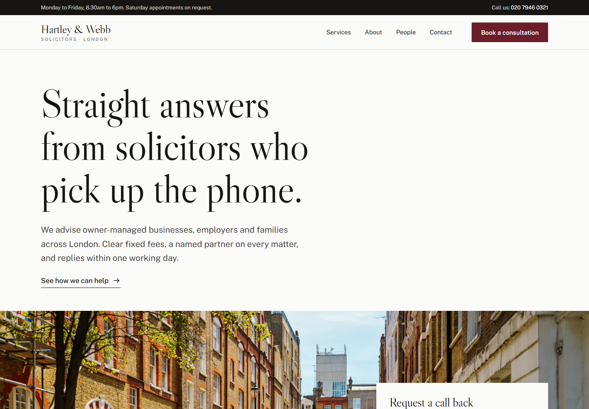

# Hartley & Webb: Professional Services Website Template

A five-page brochure website for a law firm, accountancy, consultancy or any professional services business. Plain HTML, CSS and a little JavaScript: no framework, no build step, no dependencies.



> **Hartley & Webb is a fictional firm.** All names, people, reviews, prices, addresses and registration numbers are sample content. Phone numbers use the UK range reserved for drama (020 7946 0xxx).

## Pages

| Page | What's on it |
|---|---|
| `index.html` | Headline, call-back form over a full-width photo, practice areas, why choose us, client reviews, partners |
| `services.html` | One section per service with fixed fees, what's included and FAQs, plus a fee table |
| `about.html` | Firm story, values and a timeline |
| `team.html` | Partner profiles with bios and direct contact details |
| `contact.html` | Consultation request form, address, hours and transport |

## Features

- **Lead capture on every page**: call-back form in the hero, consultation form on Contact, phone number in the top bar.
- **Forms with real validation**: inline error messages, loading state and confirmation (wire them to your form service).
- **Transparent pricing** pattern: fixed fees per service and a fee table, which builds trust for professional firms.
- **Accessible**: semantic HTML, skip link, keyboard-friendly mobile menu (Esc to close), visible focus, WCAG AA contrast, reduced-motion support. Content stays visible without JavaScript.
- **Fast**: self-hosted fonts, compressed WebP images, ~3 KB of JavaScript, no third-party requests.
- **Responsive** from small phones to wide desktops.

## Run it locally

Open `index.html` in your browser, or serve the folder:

```bash
npx serve .
```

## Customise

| What | Where |
|---|---|
| Colours and fonts | CSS variables in `:root` at the top of `styles.css` |
| Firm name, phone, address | Header and footer in each `.html` file (search for "Hartley") |
| Photos | Replace files in `images/` (keep the same names, or update the `src`) |
| Form handling | `main.js` (currently shows a demo confirmation). Point the forms at Formspree, Netlify Forms, Cloudflare Workers or your CRM |

## Deploy to Cloudflare Pages

No build step needed.

- **Dashboard:** Workers & Pages → Create → Pages → Connect to Git → pick this repo. Build command: *(none)*. Output directory: `/`.
- **CLI:**
  ```bash
  npx wrangler pages deploy . --project-name hartley-webb
  ```

## Credits

- Typefaces: [Libre Caslon Display](https://fonts.google.com/specimen/Libre+Caslon+Display) and [Public Sans](https://fonts.google.com/specimen/Public+Sans), SIL Open Font License.
- Photos from [Unsplash](https://unsplash.com), free under the [Unsplash License](https://unsplash.com/license). Team members are shown as initials; replace them with real portraits of your team.

  | File | Photographer | Source |
  |---|---|---|
  | `images/hero.webp` | Alex Wicks | https://images.unsplash.com/photo-1781370163418-e02a602826c2 |
  | `images/hero-mobile.webp` | Alex Wicks | https://images.unsplash.com/photo-1781370163418-e02a602826c2 (top crop) |
  | `images/building.webp` | Anastasiia Derkunskaia | https://images.unsplash.com/photo-1763725908870-a25a4c0b2f22 |
  | `images/office.webp` | Markus Leo | https://images.unsplash.com/photo-1566796096874-dd14890c80b4 |

- Built by **NC Atelier**.

---

### Want a site like this for your business?

NC Atelier designs and builds fast, accessible websites for businesses in the UK, US and Canada.

**Get in touch:** [ncatelier.com](https://ncatelier.com) · [LinkedIn](https://www.linkedin.com/in/cadetnicolas)
